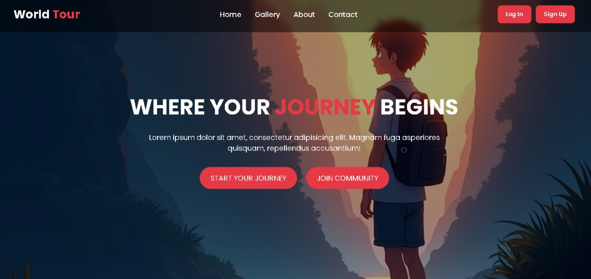
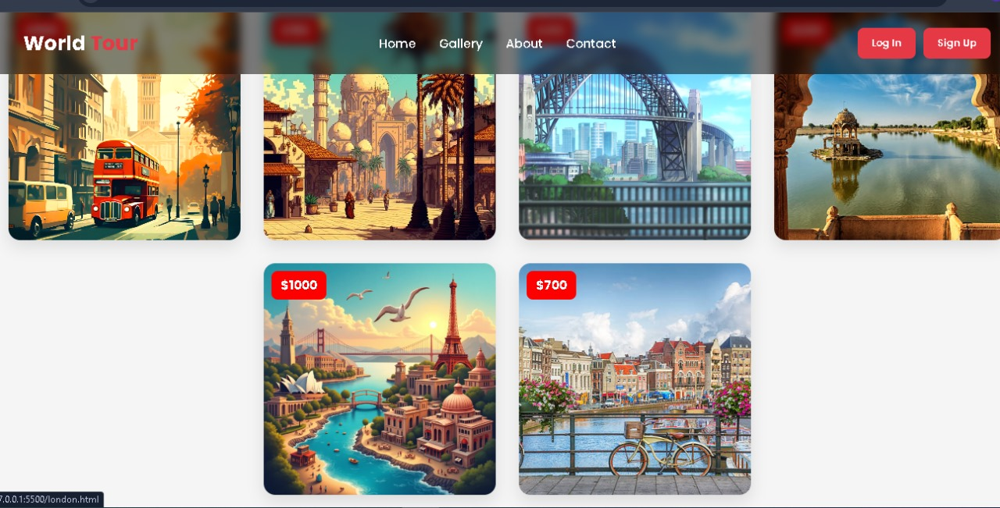
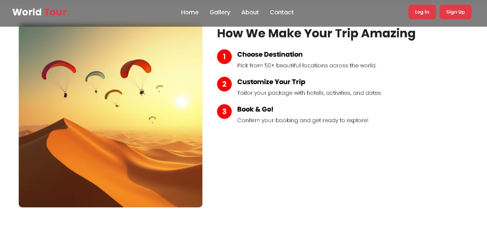
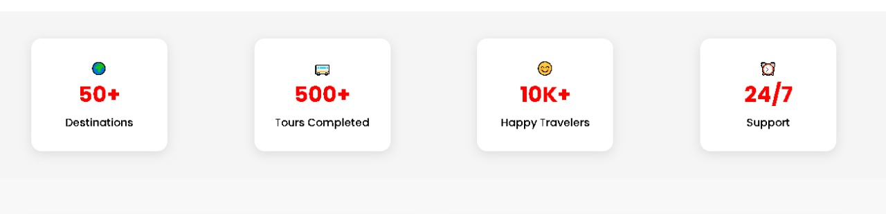
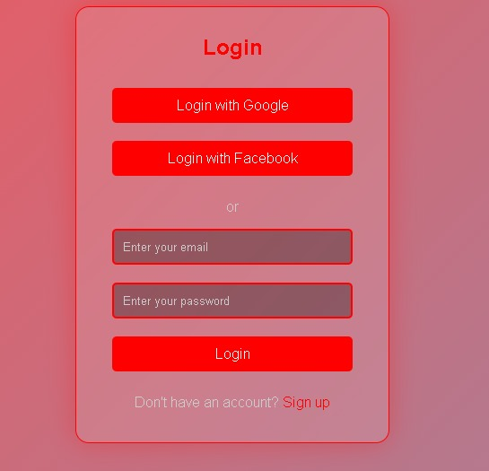
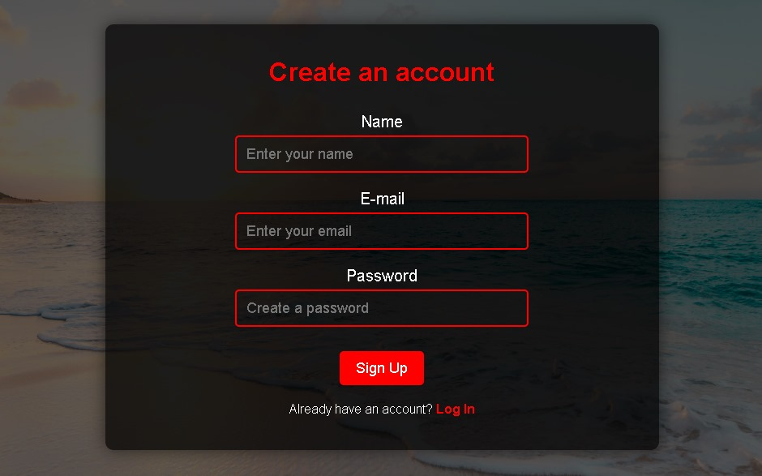

# 🌍 World Tour - Travel Website

Welcome to **World Tour**, a beautifully designed front-end travel website that lets users explore top global destinations, learn about local food and hotels, and contact or register to plan their journeys!

This is my **first big web project**, and I built it using **HTML, CSS, and JavaScript** — with interactive forms and data storage using `localStorage`.

---

## ✨ Features

- 🔥 Landing page with hero banner image & smooth scrolling
- 🖼️ Travel gallery with destination previews & pricing & Hotals reviews
- 🏨 Individual pages for cities like London, Paris, Delhi, Sydney, Amsterdam & Jaipur(My fav..)
- 📋 Contact form with validation and `localStorage` support
- 👤 Login & Sign Up pages with form validation and data saving 
- 📱 Fully responsive layout
- 💬 Simulated social login buttons (Google, Facebook) but just pop up a message only need to use backend

---

## 🚀 How to Run Locally

1. Download or clone this repo:
   ```bash
   git clone https://github.com/deepak392003/Travel-website
   ```

2. Open `index.html` in your browser.

3. Explore the gallery, navigate to city pages, or try the login/signup forms!

---

## 📸 Screenshots


- Hero section ! 
- Gallery grid 
- A city detail page , 
- Login / Sign Up forms , 
- Contact form working in DevTools (showing localStorage) 

---

## 🛠️ Technologies Used

- **HTML5** – For page structure
- **CSS3** – Custom styling with responsive layout
- **JavaScript** – For form validation, interactivity, and localStorage
- **Google Fonts** – Poppins & others
- **Icons/Emojis** – For visual appeal

---

## 📁 File Structure

```
├── index.html
├── style.css
├── script/script.js
├── Login.html
├── signUp.html
├── delhi.html
├── london.html
├── paris.html
├── jaipur.html
├── ams.html
├── sydny.html
├── /img (image folder)
└── README.md
```

---

## 🔒 Form Handling (JavaScript Features)

- **Contact Form Validation:** Validates name, email, and message
- **Stores Messages**: Saves submitted messages to `localStorage`
- **Alerts Users** with status and resets the form on success

**Main logic found in:** `script.js`

```js
localStorage.setItem('contactForm', JSON.stringify(contactForm));
```

You can view saved data using browser DevTools → Application → LocalStorage → `contactForm`.

---

## 💡 Future Plans

- Integrate Firebase Auth or backend for real login/signup
- Add Google Maps API for interactive location view (my next step after uploading this on github)
- Add a booking page for hotel selection
- Admin dashboard to view contact messages

---

## 🙌 Credits

- Design and Code: **Deepak Pandey**
- Images: Unsplash, Pexels (or your own if applicable)
- Travel Data: Self-written + research + some dummy text

---

## 📬 Contact

If you'd like to connect or provide feedback:

- 📧 Email: info@worldtour.com *(demo)*
- 📍 Based in: Jaipur, India

---

> Thanks for supporting you guys

> This project was made with 💖 as my first big step in web development.


